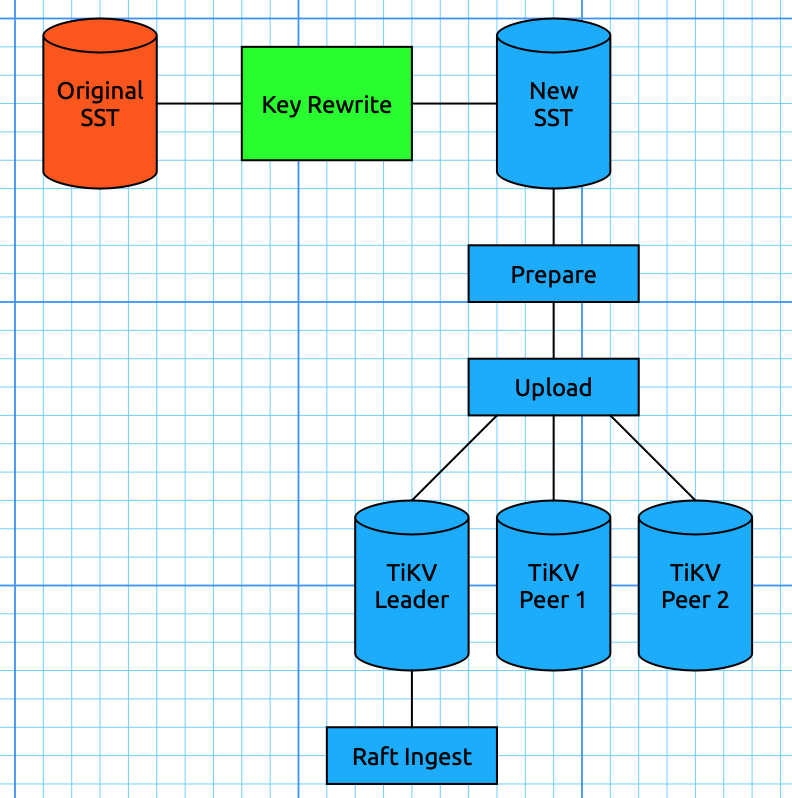
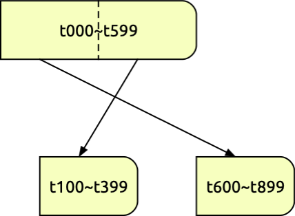
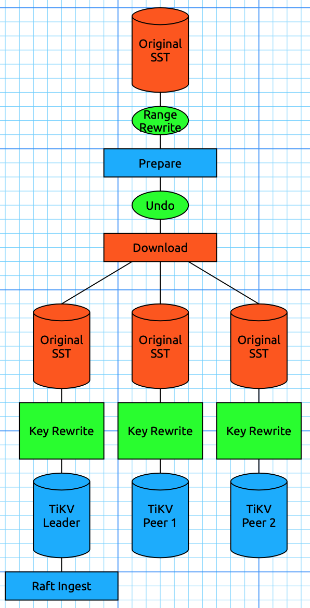

Last updated: 2019-09-12

## BR 关于 Key rewrite 的讨论

> 这篇文档记录了关于 Key rewrite 在 `tikv-importer` 中的时机的讨论。
>
> 需要注意的是，BR 现在使用的 API 并不是 `tikv-importer`，后者在讨论之后决定将其集成入 TiKV（见[讨论](./2019-09-24-BR-and-lightning-reorganization.md)）；但是关于 Key rewrite 的问题却一直存在，这篇记录可以当作参考。
>
> 现在的设计是：由 BR 端进行 Region 的 Split & Scatter 工作(prepare)，而新的 `download` 和 `ingest` API 使用类似于方案三的方法来进行导入（各个节点下载时重写键）。
>
> 目前 `tikv-importer` 是按照方案三来工作的。

### Key rewirte 结构

Key Rewrite 的目的有二：

1. 為 BR 提供修改 Table ID 的功能，以支持恢復到 Schema Version 不同的集群
2. 為 Lightning 提供添加前綴的功能，省略 Lightning ↔ Importer 之間重複的數據傳輸

一個 BR 的 SST 可能包含多個 Tables，所以要支持多條 Rewrite Rules 同時生效。SST 可能來自非 TiDB 系統，所以 Importer 不應該有 Key 編碼格式的假設（不一定是 t«tid»_ 開頭）。

給 Importer / TiKV 參考的 Key Rewrite 數據結構建議如下：

```protobuf
message RewriteRule {
	bytes old_prefix = 1;  // this can be empty for universal prefix insertion!
	bytes new_prefix = 2;  // these are _not_ just an integer!
}

message RestoreRequest {
	...
	repeated RewriteRule rewrite_rules = N;
	...
}
```

正向替代一個 Key：

```rust
fn rewrite_key(rules: &[RewriteRule], key: &[u8]) -> Cow<[u8]> {
    for rule in rules {
        if key.starts_with(rule.old_prefix) {
            return Cow::Owned(rule.new_prefix + key[rule.old_prefix.len()..])
        }
    }
    Cow::Borrowed(key)
}
```

反向還原一個 Key：

```rust
fn undo_rewrite_key(rules: &[RewriteRule], key: &[u8]) -> Cow<[u8]> {
    for rule in rules {
        if key.starts_with(rule.new_prefix) {
            return Cow::Owned(rule.old_prefix + key[rule.new_prefix.len()..])
        }
    }
    Cow::Borrowed(key)
}
```

### Key Rewrite 對現時導入流程的影響

Key Rewrite 對現時導入流程的影響
現時無論是 BR 還是 Lightning，使用的都是同一套導入流程如下：
1. 把 **KV 對**寫入到 RocksDB 實例（“**Engine File**”）來排序
2. (Prepare) 遍歷此 Engine file，
   1. (Pre-split) 每當 K+V 的累積長度達 512 MB 時（可設置），對這個 **Range** 執行 PrepareRangeJob，如下。
   2. (GetRegion) 執行 *PD* 的 *get_region_info* 取得這個 *Range.start* 對應的 *Region* 信息。
   3. (Split) 把這個 *Region* 從 *Range.end* 處使用 *split_region_opt* 分裂成兩部分。如果出 EpochNotMatch 或 NotLeader 的錯會由 b 步開始重試。
   4. (Scatter) 使用 *scatter_region* 將分裂後 *Range* 對應的 *Region* 打散。
3. (Import) 按 Prepare 步獲得的 *Ranges* 平行導入
   1. (GetRegion) 重新取得這個 *Range* 對應的 *Region*。如果現在橫跨了多個 Regions，會按 *PD* 返回的信息分割 *Range* 之後重試。
   2. (Encode) 讀取 **Engine file** 在這個 **Range** 的 **KV pairs**，然後編碼成 *SST* 格式。
   3. (Upload) 把 *SST* 分別上傳到 Peers (Leader + Followers)。
   4. (Ingest) 對 Leader (或第一個 Follower) 發送 ingest_sst 命令。

> 因为 markdown 的缘故，我们在这里用**粗体**来表示 Rewrite 之前的，用*斜体*来表示 Rewrite 之后的。

當執行了 Key Rewrite，上下游的 Key Range 就會不一致。我們使用**紅色**來標示使用 Rewrite 前的 Keys 的對象、用*藍色*標示 Rewrite 後的對象。其中不變的是：

1. 源數據必然是 Rewrite 前的
2. PD 和 Ingest 後的結果必然是 Rewrite 後的。

我們看到 Rewrite 前後的 Keys 在各步驟交叉被使用。這裡的問題是怎麼選一個合適的位置去 Rewrite Keys 來為 BR 提取最大性能。

### 方案 1: Key rewrite in “Importer” before split and scatter

即是在第 1 步寫入 KV pairs 到 Engine files 時已經先把 Keys rewrite 掉。好處是之後 2、3 步再沒有 Rewrite 前後之分，所以修改起來十分方便。壞處是 BR 的 SST files 不能無修改重用了。




假設數據源 SST 的大小是 **N**、副本數是 R。
* 源數據讀盤：**N** (Importer Key Rewrite 前)
* Importer 寫盤：**N** (Key rewrite 後寫到 Engine file)
* Importer 讀盤：2**N** (Split + Encode SST)
* TiKV 寫盤：R**N** (Upload)
* 網絡傳輸：R**N** (從 Importer 上傳到所有 TiKV)
* Key Rewrite 次數：1

### 方案 2: Key rewrite before ingest in leader

另一方面我們可以把 Key Rewrite 視為 Ingest 的一部分，這樣 TiKV 和 Importer 就能共享源數據。不過 Prepare 和找 Region Leader 這些步驟需要進行多次 Rewrite 和 Undo rewrite。


使用此方案的危機是 Range Rewrite 會打亂順序，例如我們執行 Key Rewrite Rules:
* t0 → t6 / t1 → t7 / t2 → t8
* t3 → t1 / t4 → t2 / t5 → t3



結果 [t0, t6) 的 range 就被切成兩半 [t6, t9) + [t1, t4) 了。為簡化 Split 的步驟、使 Range Rewrite 簡單寫成 [rewritten start, rewritten end) 就好，在 Pre-split 的時候必須先檢查正在使用 rewrite rule 有沒有變，有變的話不等到 512 MB 也要立即 Pre-split。

* 源數據讀盤：3**N** (Split 前 + Transmit Range Info from Importer、Key rewrite 前 in TiKV Leader)
* Importer 寫盤：0
* Importer 讀盤：0
* TiKV 寫盤：R**N**(Key rewrite 後 + Followers 暫存記錄新數據到 SST 文件 (?))
* 網絡傳輸：(R-1)**N** (Raft 協議)
* Key Rewrite 次數：2 (Pre-split + Raft-Ingest 前)

### 方案 3: Key rewrite before ingest in every replica



方案 2 仍需要 Leader 把 Rewrite 後的 SST 傳送給 Followers。如果每個 Peer 獨自 Key Rewrite 就連網絡傳輸都不需要了。當然這樣也會增加 CPU 消耗。
* 源數據讀盤：(R+1)**N** (Split 前 in Importer、Key rewrite 前 in TiKV)
* Importer 寫盤：0
* Importer 讀盤：0
* TiKV 寫盤：R**N** (Key rewrite 後暫存記錄新數據到 SST 文件 (?))
* 網絡傳輸：0
* Key Rewrite 次數：R+1 (Pre-split + Raft-Ingest 前)

### 方案 4: (其他方案) + Do not split

如果 SST 文件本身已切分成適當大小，那就不需要作 512 MB 的切分，而只需用 SST 整體的 Range [start, end)，用 Key rewrite rule 的 old_key 及 old_key + 1 為 Split key 去切分。這樣做可以省略掉方案 2、3 的 1 次 Importer 內的 Key rewrite 及所有方案的 1 次讀盤。另外 Region size 變成由 Backup 側主導而非 Restore 側主導。

### 總結

| 方案             | 1 (before split) | 2 (before ingest) | 3 (every replica) |
| ---------------- | ---------------- | ----------------- | ----------------- |
| 源數據讀盤       | N                | 3N                | (R+1)N            |
| Importer 寫盤    | N                | 0                 | 0                 |
| Importer 讀盤    | 2N               | 0                 | 0                 |
| TiKV 寫盤        | RN               | RN                | RN                |
| 網絡傳輸         | RN               | (R-1)N            | 0                 |
| Key Rewrite 次數 | 1                | 2                 | R+1               |

