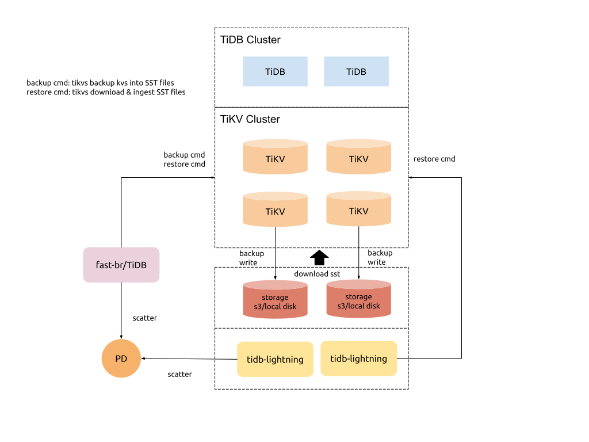

## BR & Lightning 整合

fast-br（快速备份和恢复）、mydumper、lightning 之后都会归入 backup and restore tools set (简称 BR tools set)。

fast-br 和 lightning 两个工具在实现上面有一定的功能重合。现状是 fast-br 处于开发早期，lightning 工具已经稳定和成熟，并且包含有 tidb-lightning 和 tikv-importer 两个组件。我们希望在 fast-br 的实现上不要引入新的组件进程，并且尝试考虑缩减 lightning 的使用链路，以达到达到下面的目的：

- 简化使用链路
- 整合技术实现、统一代码

### 分析

* 导入流程，以及相关的整合技术设计细节见文档 [TiKV 整合 import SST 的设计](./2019-11-05-design-of-reorganize-importSST-to-TiKV.md)。 
* 经过多次讨论后我们决定在 4.0 移除 tikv-importer 组件，只保留 lightning 作为第三方格式数据源的处理前端。
   * 将 tikv-importer 的 ingest SST files 功能放置在 TiKV 中
   * 将对 kv pairs 数据进行排序，以及 split into SST files & scatter 功能放置在 TiDB lightning

### 架构

