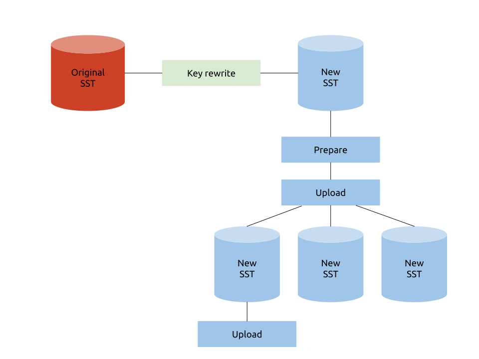
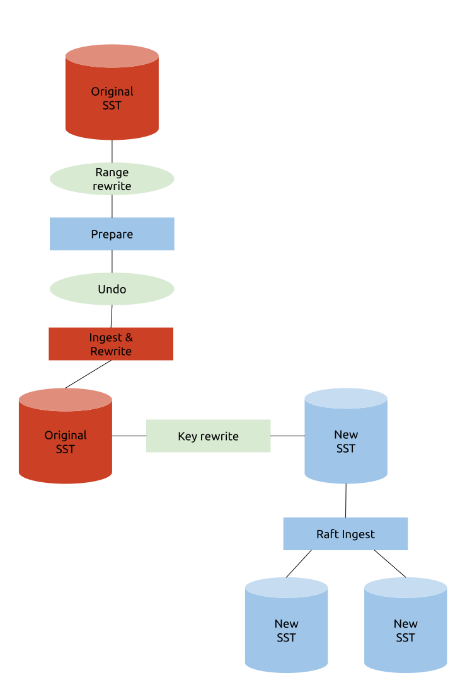
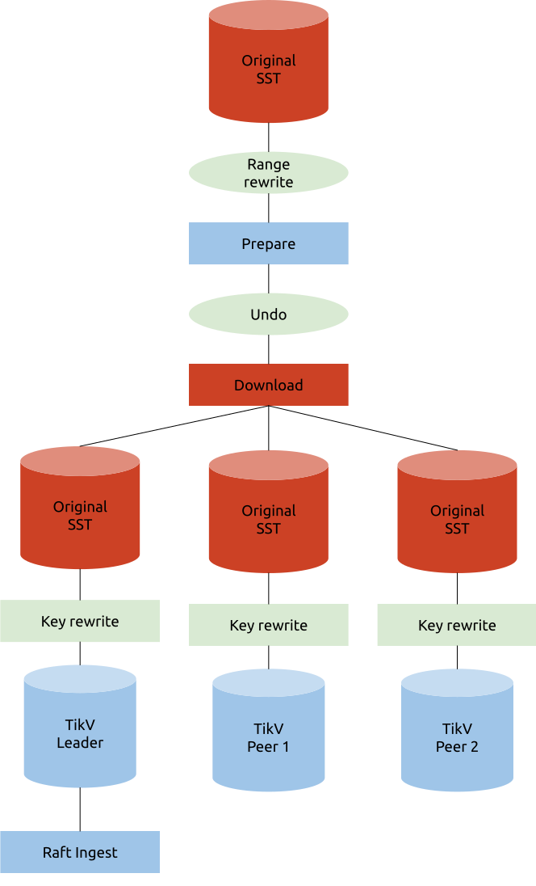

Last updated: 2019-09-12

## BR 关于 Key rewrite 的讨论

> 这篇文档记录了关于 Key rewrite 在 `tikv-importer` 中的时机的讨论。
>
> 需要注意的是，BR 现在使用的 API 并不是 `tikv-importer`，后者在讨论之后决定将其集成入 TiKV（见[讨论](./2019-09-24-BR-and-lightning-reorganization.md)）；但是关于 Key rewrite 的问题却一直存在，这篇记录可以当作参考。
>
> 现在的设计是：由 BR 端进行 Region 的 Split & Scatter 工作(prepare)，而新的 `download` 和 `ingest` API 使用类似于方案三的方法来进行导入（各个节点下载时重写键）。
>
> 目前 `tikv-importer` 是按照方案三来工作的。

### Key rewirte 结构

Key Rewrite 的目的有二：

1. 为 BR 提供修改 Table ID 的功能，以支持恢复到 Schema Version 不同的集群
2. 为 Lightning 提供添加前缀的功能，省略 Lightning ↔ Importer 之间重复的数据传输

一个 BR 的 SST 可能包含多个 Tables，所以要支持多条 Rewrite Rules 同时生效。SST 可能来自非 TiDB 系统，所以 Importer 不应该有 Key 编码格式的假设（不一定是 t«tid»_ 开头）。

给 Importer / TiKV 参考的 Key Rewrite 数据结构建议如下：

```protobuf
message RewriteRule {
	bytes old_prefix = 1;  // this can be empty for universal prefix insertion!
	bytes new_prefix = 2;  // these are _not_ just an integer!
}

message RestoreRequest {
	...
	repeated RewriteRule rewrite_rules = N;
	...
}
```

正向替代一个 Key：

```rust
fn rewrite_key(rules: &[RewriteRule], key: &[u8]) -> Cow<[u8]> {
    for rule in rules {
        if key.starts_with(rule.old_prefix) {
            return Cow::Owned(rule.new_prefix + key[rule.old_prefix.len()..])
        }
    }
    Cow::Borrowed(key)
}
```

反向还原一个 Key：

```rust
fn undo_rewrite_key(rules: &[RewriteRule], key: &[u8]) -> Cow<[u8]> {
    for rule in rules {
        if key.starts_with(rule.new_prefix) {
            return Cow::Owned(rule.old_prefix + key[rule.new_prefix.len()..])
        }
    }
    Cow::Borrowed(key)
}
```

### Key Rewrite 对现在导入流程的影响

Key Rewrite 对现在导入流程的影响
现在无论是 BR 还是 Lightning，使用的都是同一套导入流程，如下：
1. 把 **KV 对**写入到 RocksDB 实例（“**Engine File**”）来排序
2. (Prepare) 遍历此 Engine file，
   1. (Pre-split) 每当 K+V 的累积长度达 512 MB 时（可设置），对这个 **Range** 执行 PrepareRangeJob，如下。
   2. (GetRegion) 执行 *PD* 的 *get_region_info* 取得这个 *Range.start* 对应的 *Region* 信息。
   3. (Split) 把这个 *Region* 从 *Range.end* 处使用 *split_region_opt* 分裂成两部分。如果出 EpochNotMatch 或 NotLeader 的错会由 b 步开始重试。
   4. (Scatter) 使用 *scatter_region* 将分裂后 *Range* 对应的 *Region* 打散。
3. (Import) 按 Prepare 步获得的 *Ranges* 并行导入
   1. (GetRegion) 重新取得这个 *Range* 对应的 *Region*。如果现在横跨了多个 Regions，会按 *PD* 返回的信息分割 *Range* 之后重试。
   2. (Encode) 读取 **Engine file** 在这个 **Range** 的 **KV pairs**，然后编码成 *SST* 格式。
   3. (Upload) 把 *SST* 分别上传到 Peers (Leader + Followers)。
   4. (Ingest) 对 Leader (或第一个 Follower) 发送 ingest_sst 命令。

> 因为 markdown 的缘故，我们在这里用**粗体**来表示 Rewrite 之前的，用*斜体*来表示 Rewrite 之后的。

当执行了 Key Rewrite，上下游的 Key Range 就会不一致。我们使用**红色**来标示使用 Rewrite 前的 Keys 的对象、用*蓝色*标示 Rewrite 后的对象。其中不变的是：

1. 源数据必然是 Rewrite 前的
2. PD 和 Ingest 后的结果必然是 Rewrite 后的。

我们看到 Rewrite 前后的 Keys 在各步骤交叉被使用。这里的问题是怎么选一个合适的位置去 Rewrite Keys 来为 BR 提取最大性能。

### 方案 1: Key rewrite in “Importer” before split and scatter

即是在第 1 步写入 KV pairs 到 Engine files 时已经先把 Keys rewrite 掉。好处是之后 2、3 步再没有 Rewrite 前后之分，所以修改起来十分方便。坏处是 BR 的 SST files 不能无修改重用了。




假设数据源 SST 的大小是 **N**、副本数是 R。
* 源数据读盘：**N** (Importer Key Rewrite 前)
* Importer 写盘：**N** (Key rewrite 后写到 Engine file)
* Importer 读盘：2**N** (Split + Encode SST)
* TiKV 写盘：R**N** (Upload)
* 网络传输：R**N** (从 Importer 上传到所有 TiKV)
* Key Rewrite 次数：1

### 方案 2: Key rewrite before ingest in leader

另一方面我们可以把 Key Rewrite 视为 Ingest 的一部分，这样 TiKV 和 Importer 就能共享源数据。不过 Prepare 和找 Region Leader 这些步骤需要进行多次 Rewrite 和 Undo rewrite。




使用此方案的风险是 Range Rewrite 会打乱顺序，例如我们执行 Key Rewrite Rules:
* t0 → t6 / t1 → t7 / t2 → t8
* t3 → t1 / t4 → t2 / t5 → t3


结果 [t0, t6) 的 range 就被切成两半 [t6, t9) + [t1, t4) 了。为简化 Split 的步骤、使 Range Rewrite 简单写成 [rewritten start, rewritten end) 就好，在 Pre-split 的时候必须先检查正在使用 rewrite rule 有没有变，有变的话不等到 512 MB 也要立即 Pre-split。

* 源数据读盘：3**N** (Split 前 + Transmit Range Info from Importer、Key rewrite 前 in TiKV Leader)
* Importer 写盘：0
* Importer 读盘：0
* TiKV 写盘：R**N**(Key rewrite 后 + Followers 暂存记录新数据到 SST 文件 (?))
* 网络传输：(R-1)**N** (Raft 协议)
* Key Rewrite 次数：2 (Pre-split + Raft-Ingest 前)

### 方案 3: Key rewrite before ingest in every replica



方案 2 仍需要 Leader 把 Rewrite 后的 SST 传送给 Followers。如果每个 Peer 独自 Key Rewrite 就连网络传输都不需要了。当然这样也会增加 CPU 消耗。
* 源数据读盘：(R+1)**N** (Split 前 in Importer、Key rewrite 前 in TiKV)
* Importer 写盘：0
* Importer 读盘：0
* TiKV 写盘：R**N** (Key rewrite 后暂存记录新数据到 SST 文件 (?))
* 网络传输：0
* Key Rewrite 次数：R+1 (Pre-split + Raft-Ingest 前)

### 方案 4: (其他方案) + Do not split

如果 SST 文件本身已切分成适当大小，那就不需要作 512 MB 的切分，而只需用 SST 整体的 Range [start, end)，用 Key rewrite rule 的 old_key 及 old_key + 1 为 Split key 去切分。这样做可以省略掉方案 2、3 的 1 次 Importer 内的 Key rewrite 及所有方案的 1 次读盘。另外 Region size 变成由 Backup 侧主导而非 Restore 侧主导。

### 总结

| 方案             | 1 (before split) | 2 (before ingest) | 3 (every replica) |
| ---------------- | ---------------- | ----------------- | ----------------- |
| 源数据读盘       | N                | 3N                | (R+1)N            |
| Importer 写盘    | N                | 0                 | 0                 |
| Importer 读盘    | 2N               | 0                 | 0                 |
| TiKV 写盘        | RN               | RN                | RN                |
| 网络传输         | RN               | (R-1)N            | 0                 |
| Key Rewrite 次数 | 1                | 2                 | R+1               |
