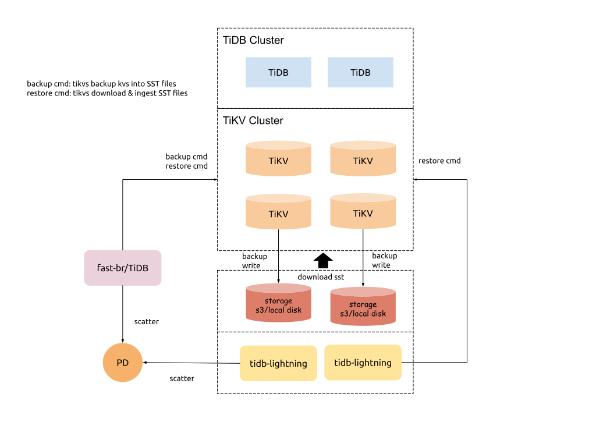

Last updated: 2020-02-28

## BR & Lightning 整合

fast-br（快速备份和恢复）、mydumper、lightning 之后都会归入 backup and restore tools set (简称 BR tools set)。

fast-br 和 lightning 两个工具在实现上面有一定的功能重合。现状是 fast-br 处于开发早期，lightning 工具已经稳定和成熟，并且包含有 tidb-lightning 和 tikv-importer 两个组件。我们希望在 fast-br 的实现上不要引入新的组件进程，并且尝试考虑缩减 lightning 的使用链路，以达到达到下面的目的：

- 简化使用链路
- 整合技术实现、统一代码

### 分析

* 导入流程，以及相关的整合技术设计细节见文档 [TiKV 整合 import SST 的设计](./2019-11-05-design-of-reorganize-importSST-to-TiKV.md)。 
* 经过多次讨论后我们决定在 4.0 移除 tikv-importer 组件，只保留 lightning 作为第三方格式数据源的处理前端。
   * 将 tikv-importer 的 ingest SST files 功能放置在 TiKV 中
   * 将对 kv pairs 数据进行排序，以及 split into SST files & scatter 功能放置在 TiDB lightning

### 架构

下面介绍了 BR tools set 包含的组件的功能：
#### tidb-lightning
处理第三方格式数据源文件，对外输出组织好的 SST files（与 fast-BR 的备份输出格式兼容）。
* 读取不同源端的数据；本地磁盘/S3 等
* 读取不同格式数据源；非 fast-BR 备份输出格式，如 mydumper dump files、 csv 等
* 处理数据源数据
   * 转化为 kv pairs format (in tikv)
   * 保存到本地 engine file（目前实现为 rocksdb）
   * 完成排序
* split & scatter
   * 将 engine file 拆分成固定大小的 key range
   * 对 key ranges 进行 key rewrite 
   * 将 key rewrite 后的 key ranges 调用 pd 接口进行 split & scatter，获取到 region 信息 (key range after rewrite, region ID, leader and peer IP, etc.)
* split & scatter 完成后，发起 restore 处理流程
   * 对指定 tikv 发起 restore cmd(download & ingest SST files)
   * 对指定 tikv 提供 download SST files 服务

#### TiKV
* download SST files from storage/tidb-lightning
* apply key rewrite rule on SST files
* ingest SST files(through raft)

#### fast-br/tidb
快速备份和恢复的命令行入口，下发命令到对应的 tikvs
* backup - 对指定的 tikvs 发起 backup cmd(scan kvs and save as specified format SST files)
* restore - 对指定的 tikvs 发起 restore cmd
   * split SST files & scatter regions
   * 发送命令到指定 tikv 让其 download sst + key rewrite + ingest sst (see “TiKV” above)